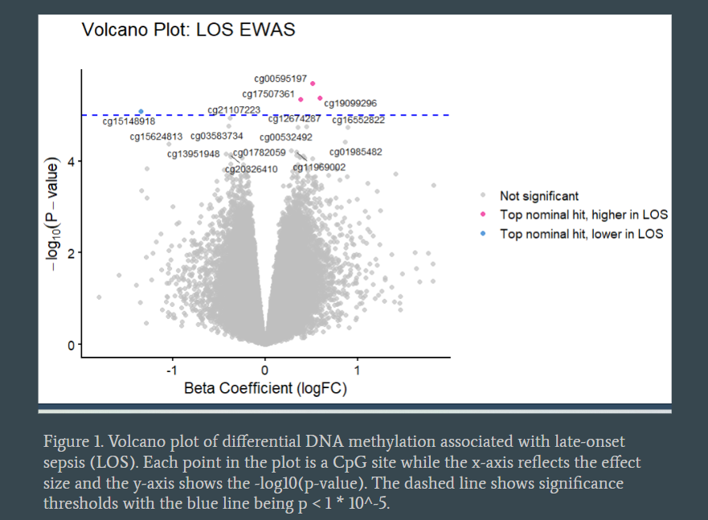

## Interactive Dashboard Looking at Prevalence of Ovarian Cysts and PBB-153 and PCBs exposure

[View Dashboard](https://ai2w8v-mirra-chinta.shinyapps.io/CurrentTopicsViz/#section-analysis)

This interactive dashboard explores ovarian cyst prevalence with PCBs and PBB-153 exposure, showing spine plots and forest plots. It includes data visualizations and analysis tools built using R Shiny.

## DNA Methylation Volcano Plot

This volcano plot shows nominal hits for CpG sites looking at associations between DNA methylation and late onset sepsis for preterm infants.
